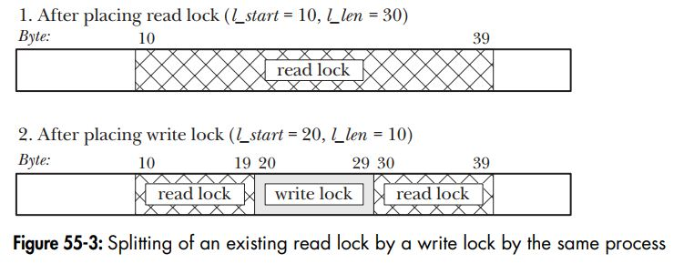

## file-lock ipc
- flock(), which places locks on entire files; The flock() system call originated on BSD. 
- fcntl(), which places locks on regions of a file. fcntl() originated on System V

> - Advisory and mandatory locking
>> - By default, file locks are advisory. This means that a process can simply ignore a lock placed by another process. In order for an advisory locking scheme to be workable, each process accessing the file must cooperate, by placing a lock before performing file I/O.
>> - By contrast, a mandatory locking system forces a process performing I/O to abide by the locks held by other processes. We say more
about this distinction in Section 55.4.


### 1. FLOCK() Semantics of Lock Inheritance and Release
- A file lock obtained via flock() **is associated with the open file description (Section 5.4), rather than the file descriptor or the file (i-node) itself**. This means that when a file descriptor is duplicated (via dup(), dup2(), or an fcntl() F_DUPFD operation), the new file descriptor refers to the same file lock.
```C++
    flock(fd, LOCK_EX); /* Gain lock via 'fd' */
    newfd = dup(fd); /* 'newfd' refers to same lock as 'fd' */
    flock(newfd, LOCK_UN); /* Frees lock acquired via 'fd' */
```
- If we have acquired a lock via a particular file descriptor, and we create one or more duplicates of that descriptor, **then—if we don’t explicitly perform an unlock operation the lock is released only when all of the duplicate descriptors have been closed**.
> - However, **if we use open() to obtain a second file descriptor (and associated open file description) referring to the same file, this second descriptor is treated independently by flock()**. For example, a process executing the following code will block on the second flock() call:

- When we create a child process using fork(), that child obtains duplicates of its parent’s file descriptors, and, as with descriptors duplicated via dup() and so on, these descriptors refer to the same open file descriptions and thus to the same locks. For example, the following code causes a child to remove a parent’s lock:
```C++
    flock(fd, LOCK_EX); /* Parent obtains lock */
    if (fork() == 0) /* If child... */
    flock(fd, LOCK_UN); /* Release lock shared with parent */
```
- These semantics can sometimes be usefully exploited to (atomically) **transfer a file lock from a parent process to a child process**: after the fork(), the parent closes its file descriptor, and the lock is under sole control of the child process. **As we’ll see later, this isn’t possible using record locks obtained by fcntl().**
- **Locks created by flock() are preserved across an exec()** (unless the close-on-exec flag was set for the file descriptor and that file descriptor was the last one referencing the underlying open file description).

#### Limitations of flock()
- Only whole files can be locked. Such coarse locking limits the potential for concurrency among cooperating processes. If, for example, we have multiple processes, each of which would like to simultaneously access different parts of the same file, then locking via flock() would needlessly prevent these processes from operating concurrently.
- We can place only advisory locks with flock().
- Many NFS implementations don’t recognize locks granted by flock().


### 2. fcntl() Semantics of Lock Inheritance and Release
- **Record locks are not inherited across a fork() by a child process**. This contrasts with flock(), where the child inherits a reference to the same lock and can release this lock, with the consequence that the parent also loses the lock.
- **All of the threads in a process share the same set of record locks**
- **Record locks are associated with both a process and an i-node** (refer to Section 5.4). An unsurprising consequence of this association is that when a process terminates, all of its record locks are released. Less expected is that whenever a process closes a file descriptor, all locks held by the process on the corresponding file are released, regardless of the file descriptor(s) through which the locks were obtained. For example, in the following code, **the close(fd2) call releases the lock held by the calling process on testfile, even though the lock was obtained via the file descriptor fd1:**
```C++
    struct flock fl;
    fl.l_type = F_WRLCK;
    fl.l_whence = SEEK_SET;
    fl.l_start = 0;
    fl.l_len = 0;
    fd1 = open("testfile", O_RDWR);
    fd2 = open("testfile", O_RDWR);
    if (fcntl(fd1, cmd, &fl) == -1)
    errExit("fcntl");
    close(fd2);
```

#### fcntl() Details of lock acquisition and release
- Unlocking a file region always immediately succeeds. It is not an error to unlock a region on which we don’t currently hold a lock
- **At any time, a process can hold just one type of lock on a particular region of a file. Placing a new lock on a region we have already locked either results in no change** (if the lock type is the same as the existing lock) or atomically converts the existing lock to the new mode. In the latter case, when converting a read lock to a write lock, we need to be prepared for the possibility that the call will yield an error (F_SETLK) or block (F_SETLKW). **(This differs from flock(), whose lock conversions are not atomic.)**
- **A process can never lock itself out of a file region**, even when placing locks via multiple file descriptors referring to the same file. (This contrasts with flock(), and we say more on this point in Section 55.3.5.)
- **Placing a lock of a different mode in the middle of a lock we already hold results in three locks**: two smaller locks in the previous mode are created on either side of the new lock (see Figure 55-3). Conversely, acquiring a second lock adjacent to or overlapping an existing lock in the same mode results in a single coalesced lock covering the combined area of the two locks. Other permutations are possible. 
- Closing a file descriptor has some unusual semantics with respect to file region locks. We describe these semantics in Section 55.3.5.
> 